# TaskFlow DevOps

Task management application built with Node.js, PostgreSQL, Docker, Monitoring, and CI/CD.

## Features

- User Registration
- User Login
- JWT Authentication
- Protected Routes
- Task CRUD Operations
- React Frontend
- Dashboard UI
- Logout Functionality
- PostgreSQL Database
- Docker Containerization
- Prometheus Monitoring
- Grafana Dashboard
- GitHub Actions CI Pipeline

---

## Tech Stack

### Architecture

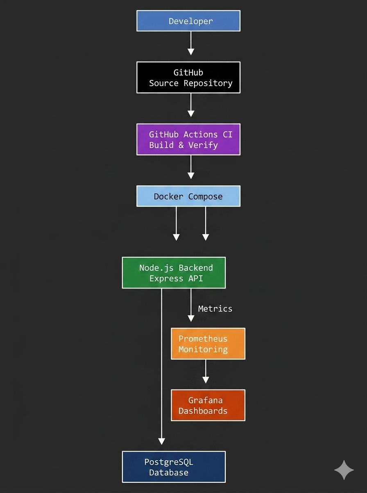

### Frontend

- React
- React Router DOM
- Axios
- Bootstrap

### Backend

- Node.js
- Express.js
- PostgreSQL
- JWT
- bcrypt

### DevOps

- Docker
- Docker Compose
- Prometheus
- Grafana
- GitHub Actions
- Railway

---

## Project Structure

```text
taskflow-devops/
├── backend/
│   ├── src/
│   ├── Dockerfile
│   └── package.json
│
├── monitoring/
│   ├── prometheus.yml
│   └── grafana/
│
├── docs/
│   └── screenshots/
│
├── docker-compose.yml
└── README.md
```

---

## API Endpoints

### Authentication

| Method | Endpoint | Description |
|----------|----------|----------|
| POST | /api/auth/register | Register User |
| POST | /api/auth/login | Login User |

### Tasks

| Method | Endpoint | Description |
|----------|----------|----------|
| POST | /api/tasks | Create Task |
| GET | /api/tasks | Get Tasks |
| PUT | /api/tasks/:id | Update Task |
| DELETE | /api/tasks/:id | Delete Task |

---
## Deployment

Application deployed using Railway:

https://taskflow-devops-production.up.railway.app

## Monitoring

### Prometheus

Application metrics exposed through:

http://localhost:5000/metrics

### Grafana

Dashboard monitoring available through Grafana.

---

## CI/CD

GitHub Actions automatically runs on:

- Push to main
- Pull Request to main

Workflow:

```text
Install Dependencies
↓
Verify Packages
↓
Success
```

---

## Screenshots

### User Registration

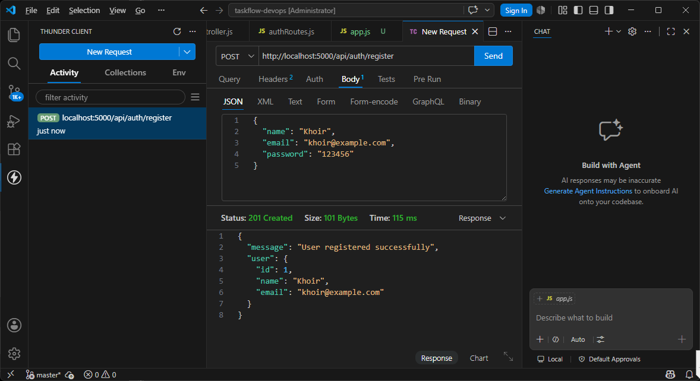

### Login API

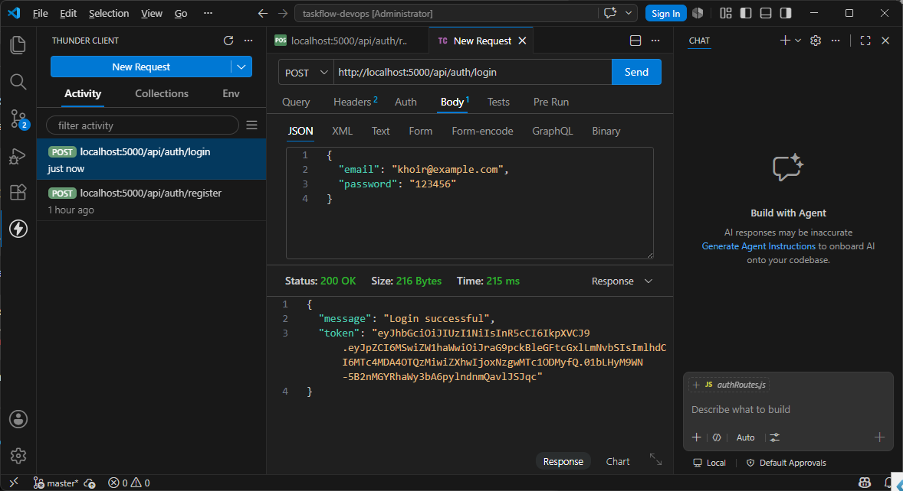

### JWT Protected Route

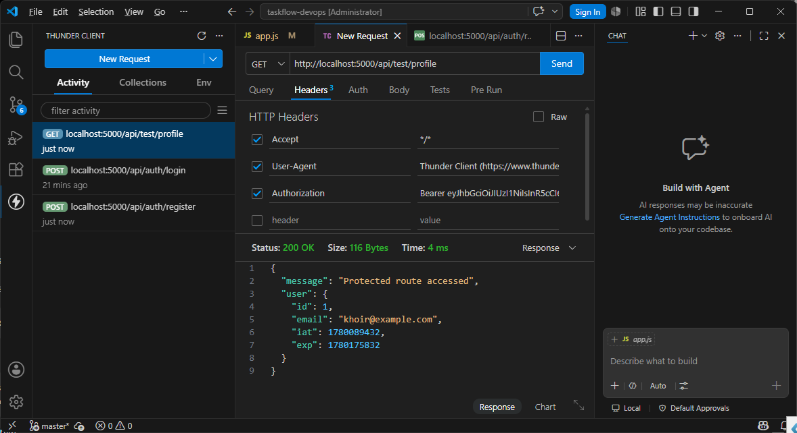

### Create Task

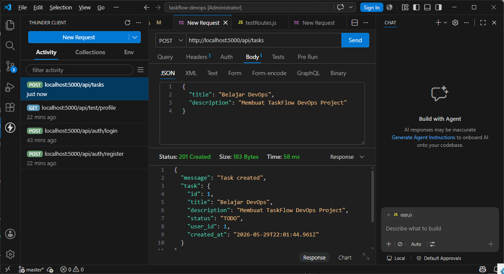

### Get Tasks

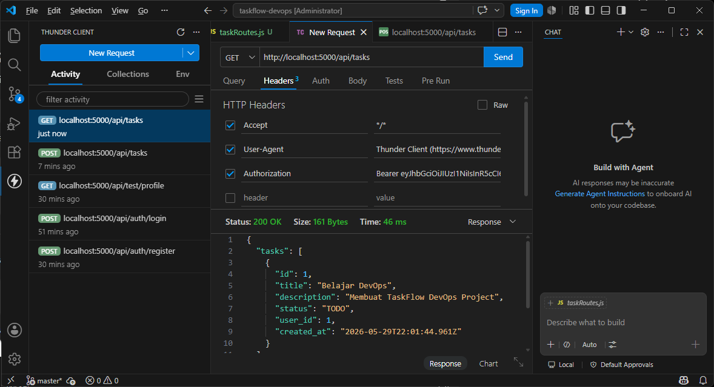

### Update Task

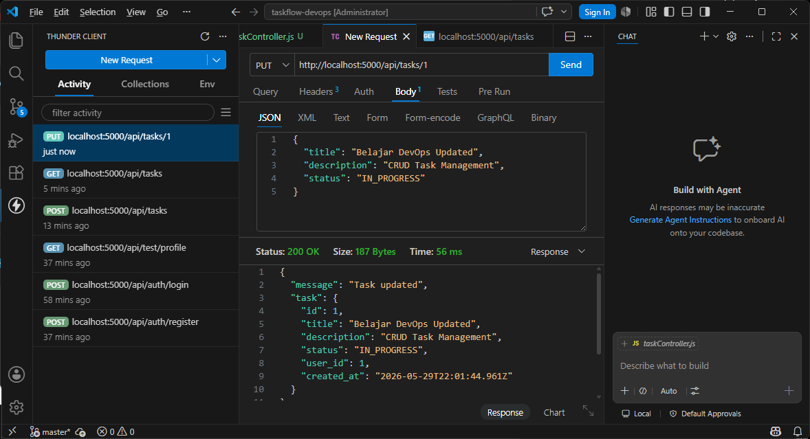

### Delete Task

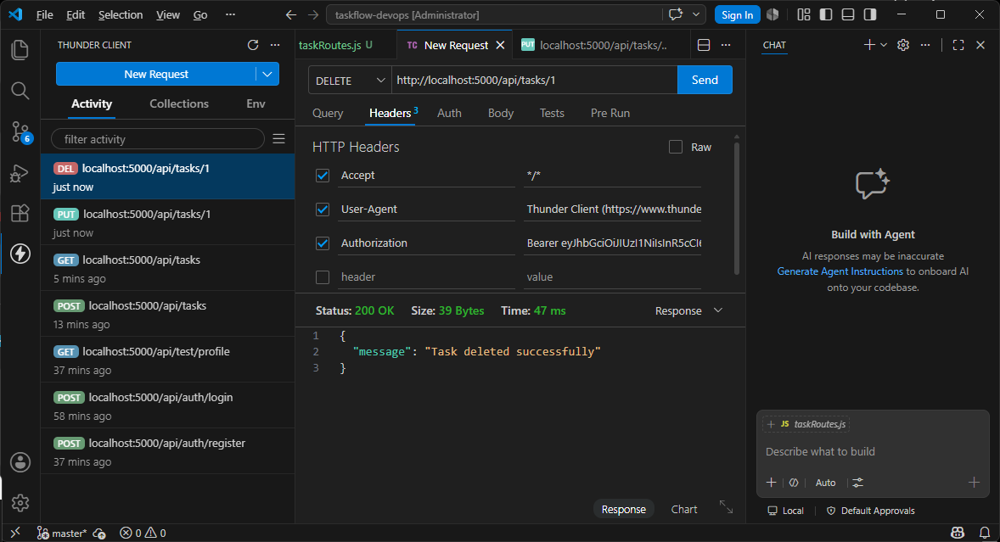

### Docker

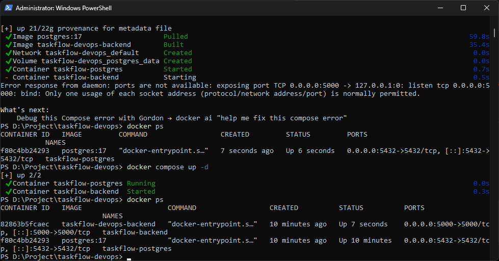

### Railway Deployment

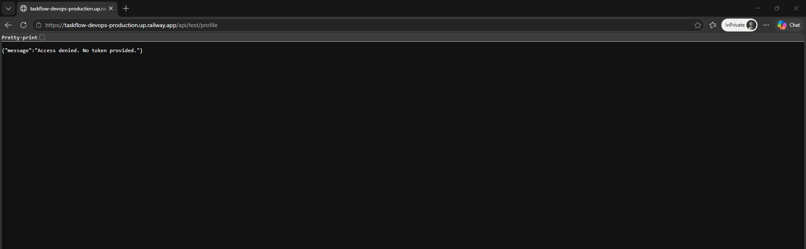

### Prometheus

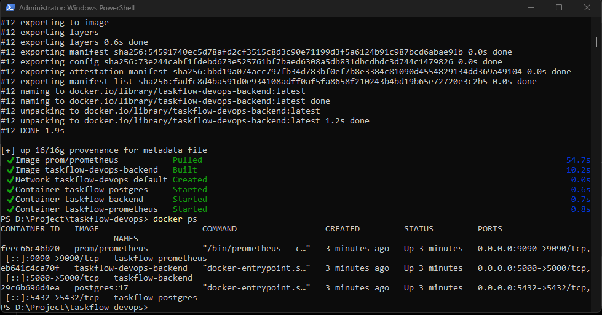

### Grafana

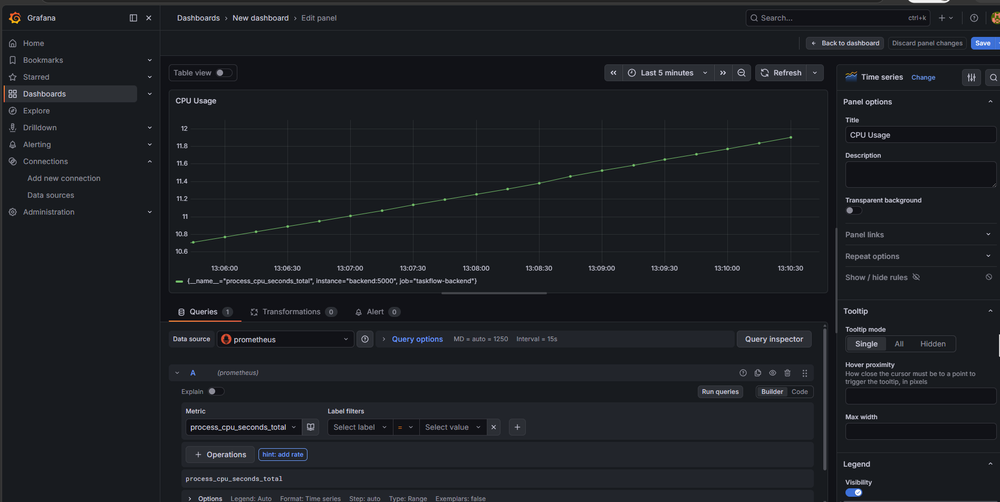

### GitHub Actions

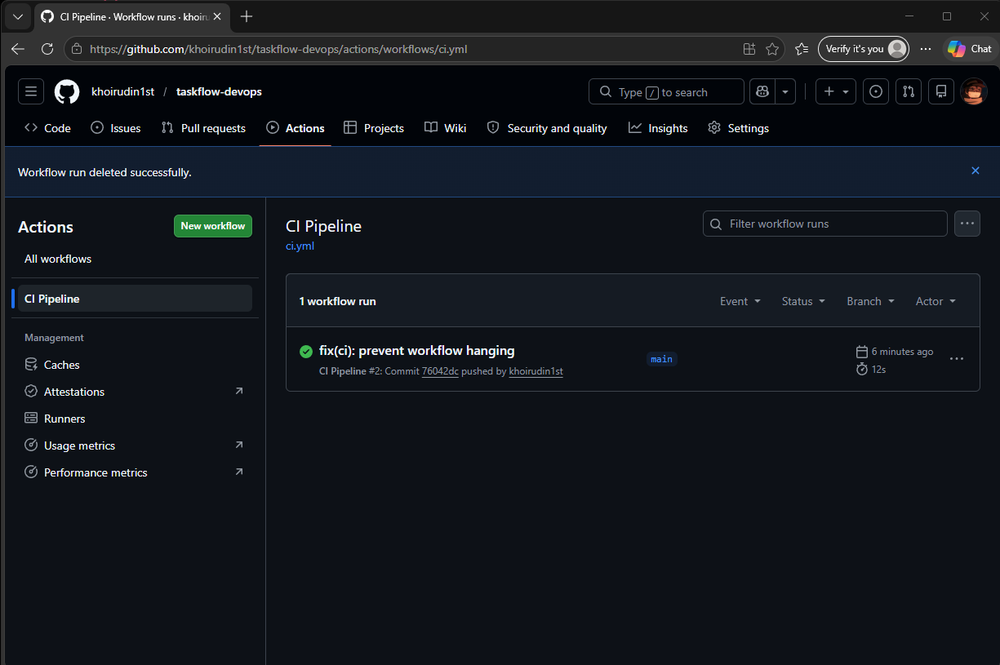

### Frontend Login

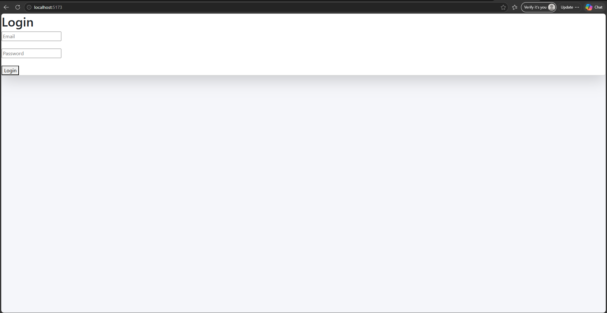

### Frontend Dashboard

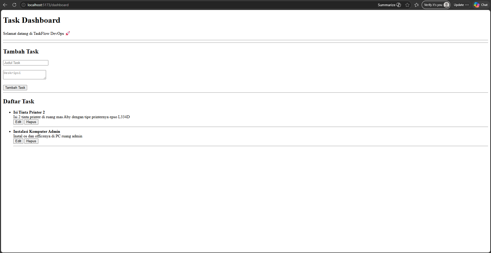

---

## Conclusion

TaskFlow DevOps successfully implements:

- JWT Authentication
- Task CRUD Operations
- PostgreSQL Database
- React Frontend
- Docker Containerization
- CI/CD with GitHub Actions
- Railway Deployment
- Monitoring with Prometheus and Grafana

This project demonstrates the implementation of modern DevOps practices in a full-stack web application.

---

## Author

Khoirudin